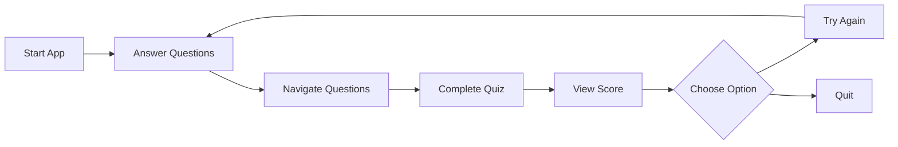

# Python Quiz Application 🎯

<div align="center">
A desktop quiz application built with wxPython that tests knowledge across multiple programming topics including wxPython, Node.js, Data Structures & Algorithms (DSA), and Aptitude questions.
</div>

## ✨ Features

<table>
  <tr>
    <td>
      <ul>
        <li>10 Multiple choice questions across categories</li>
        <li>Real-time score tracking</li>
        <li>Visual feedback for answers</li>
        <li>Navigation between questions</li>
      </ul>
    </td>
    <td>
      <ul>
        <li>Final score display</li>
        <li>Performance feedback</li>
        <li>Retry option</li>
        <li>Category indicators</li>
      </ul>
    </td>
  </tr>
</table>

## 🚀 Prerequisites

Before running this application, ensure you have:

- Python 3.x installed
- wxPython library installed

```bash
# Install wxPython using pip
pip install wxPython
```

## 💻 Installation

1. Clone this repository:
```bash
git clone https://github.com/chuadharysagar/quize-app-python.git
```

2. Navigate to the project directory:
```bash
cd quize-app-python
```

3. Run the application:
```bash
python quizeapp.py
```

## 📖 Quiz Categories

<details>
<summary><b>wxPython (3 questions)</b></summary>

- Event loops
- Widget hierarchy
- Layout management
</details>

<details>
<summary><b>Node.js (3 questions)</b></summary>

- Web server creation
- Package management
- Frameworks
</details>

<details>
<summary><b>Data Structures & Algorithms (2 questions)</b></summary>

- Time complexity
- Basic data structures
</details>

<details>
<summary><b>Aptitude (2 questions)</b></summary>

- Mathematical reasoning
- Problem-solving
</details>

## 🎯 Features in Detail

### Answer Feedback
```
✅ Correct answers: Green highlight
❌ Incorrect answers: Red highlight
🎯 Shows correct answer when wrong option selected
```

### Navigation
```
⬅️ Previous button: Move to earlier questions
➡️ Next button: Proceed to next question
🔒 Buttons disable at start/end of quiz
```

### Score Tracking
```
📊 Real-time score updates
📈 Final score as fraction and percentage
💬 Performance-based feedback
```

## 📷 Screenshots

<div>

### Main Interface


### Answer Selection


### Final Score Dialog


</div>

## 🛠️ Flow Chart



## 🎮 Controls

| Action | Description |
|--------|-------------|
| Click Option | Select answer |
| Next Button | Move to next question |
| Previous Button | Return to previous question |
| Try Again | Restart quiz |
| Quit | Close application |
</div>
