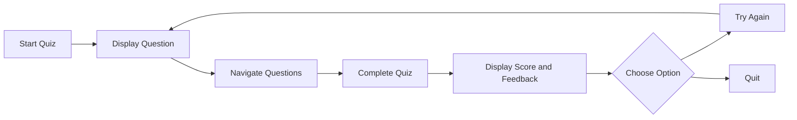

# Quiz Application With Flask 🎯

<div align="center">
A quiz application built with Flask and JavaScript that delivers questions across various categories, including Geography, Programming, Web Development, Mathematics, and more.
</div>

## ✨ Features

<table>
  <tr>
    <td>
      <ul>
        <li>Multiple choice questions categorized by topic</li>
        <li>Real-time score tracking and display</li>
        <li>Visual feedback for correct and incorrect answers</li>
        <li>Navigation between questions with next and previous buttons</li>
      </ul>
    </td>
    <td>
      <ul>
        <li>Final score display with performance-based quotes</li>
        <li>Retry option to restart the quiz</li>
        <li>Category indicators for each question</li>
        <li>Responsive and user-friendly UI</li>
      </ul>
    </td>
  </tr>
</table>

## 🚀 Prerequisites

Before running this application, ensure you have:

- Python 3.x installed
- Flask and Flask-CORS libraries installed

```bash
# Install Flask and Flask-CORS using pip
pip install Flask
pip install Flask Flask-CORS
```


## 💻 Installation

1. Clone this repository:
```bash
git clone https://github.com/chuadharysagar/quiz-app-flask.git
```

2. Navigate to the project directory:
```bash
cd quize-app-flask
```

3. Run the application:
```bash
python3 app.py
```
4. Open index.html in your browser to start the quiz.

## 📖 Quiz Categories

<details> 
  <summary><b>Geography</b></summary>
  Capitals<br>
  Continents<br>
  Physical geography
</details>

<details> 
  <summary><b>Programming</b></summary>
  Data types<br>
  Syntax<br>
  Language history
</details> 

<details> 
  <summary><b>Web Development</b></summary>
  HTML<br>
  CSS<br>
  JavaScript basics
</details> 

<details> 
  <summary><b>Mathematics</b></summary>
  Arithmetic<br>
  Algebra<br>
  Problem-solving
</details>


## 🎯 Features in Detail

### Answer Feedback
```
✅ Correct answers: Green highlight
❌ Incorrect answers: Red highlight
🎯 Shows correct answer when wrong option selected
```

### Navigation
```
⬅️ Previous button: Move to earlier questions
➡️ Next button: Proceed to next question
🔒 Buttons disable at start/end of quiz
```

### Score Tracking
```
📊 Real-time score updates
📈 Final score as fraction and percentage
💬 Performance-based feedback
```

## 📷 Screenshots

<div>

### Main Interface


### Answer Selection


### Final Score Dialog


</div>

## 🛠️ Flow Chart



## 🎮 Controls

| Action | Description |
|--------|-------------|
| Click Option | Select answer |
| Next Button | Move to next question |
| Previous Button | Return to previous question |
| Try Again | Restart quiz |
| Quit | Close application |
</div>
